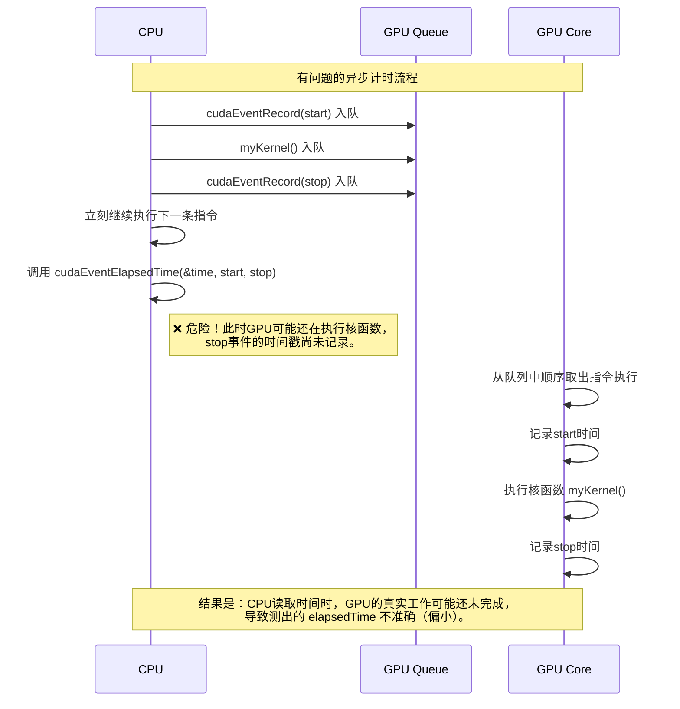

### 内置变量
`gridDim` :是所有块的常数,仅保留启动启动网格的尺寸
1. **`gridDim` 是只读的**：在核函数中不能修改 `gridDim`
2. **维度是三维的**：即使只指定了二维，`gridDim.z` 也会是1
3. **最大限制**：各维度有最大限制（通过 `cudaGetDeviceProperties` 获取）
4. **动态网格**：网格维度可以在运行时计算，不需要是编译时常量
```cpp
__global__ void kernel(...){
gridDim.x; //100
gridDim.y; //200
gridDim.z; //300
}

int main(void){
dim3 grid(100,200,300);
...
}
```

cuda执行模式:
先执行 cudaMalloc（），
再使用分配内存的设备代码，
最后用 cudaFree（） 清理。
# 第五章 线程联动(threads cooperation)

## 拆分并行块(splitting parallel blocks)

**原因** : 每个block中的thread数量有限制(512),有时候会不够用,为了避开这个限制,我们用**全局索引计算(索引线性化)**（Global Index Calculation），或者更具体地，它是一种将多维的网格和块结构映射到一维全局索引的常用方法。即:
`int tid = threadIdx.x + blockIdx.x * blockDim.x`

而实践中一般在一个block中启动128个threads
	- **核心原因：性能优化平衡**:
		1. 占用率优化(occupancy optimization)
			占用率 = 活跃的线程数 / GPU支持的最大线程数
			更高的占用率通常意味着更好的硬件利用率
			512:__一旦每个线程需要比较多的寄存器,那寄存器很可能不够用,导致一些线程inactive,__
			128: 相同占用率,但使用了更多的块,可以有更多的调度灵活性
		2. 寄存器压力(register pressure)
			同上
		3. 隐藏延迟(latency hiding)
			更多的线程块意味着更好的延迟隐藏
			GPU可以在一个warp等待内存时切换到另一个warp
			512线程/块: 16个warp（512÷32）
			128线程/块: 4个warp    (128÷32)
			虽然512线程的块有更多warp，但：
			- 如果内存访问模式不好，16个warp可能都在等待
			- 128线程的块更小，SM可以容纳更多块，跨块的warp切换可能更高效
	- 实践中128更常见:
		1. **适应性更强**(对于不同复杂度的内核，128更稳健,更多块意味着更好的负载平衡和延迟隐藏)
		2. **更适合现代GPU架构**
			现代GPU（如Ampere）有更多SM但每SM线程数可能更少
			对于并行性好的任务，小块的负载分布更均匀
			512: 可能某些SM空闲，某些SM过载
		3. **减少尾部效应（Tail Effect）**
			如果总线程数不是块大小的整数倍,512的浪费比例更大
		4. **共享内存效率**	
			使用共享内存的算法通常有最优块大小
			每个SM共享内存有限（如48KB）
		    块大小越大，每块共享内存越多，每SM能容纳的块越少

___trick:___ 计算128threads/block时 , n个threads需要启动多少个block:
直接除会导致拥挤,不用ceil()函数(向上取整)的取巧做法:
___kernel<<<(N+127)/128, 128>>>()___

新的问题:如果thread过多,超出了数组的长度:会直接停止计算
因此 我们必须先检查线程的偏移量是否实际上介于 0 和 N 之间，才能用它访问输入和输出数组：
```cpp
if (tid < N)
	c[tid] = a[tid] + b[tid]
```

继续考虑更长的数组,因为不但是线程数量有限制,block数量也有限制,即grid的任意维度都不能超过65535
解决办法:
**"网格跨步循环"（Grid-Stride Loop）**
```cpp
__global__ void add( int *a, int *b, int *c )
{
	int tid = threadIdx.x + blockIdx.x * blockDim.x;
	while (tid < N) {
		c[tid] = a[tid] + b[tid] ;
		tid += blockDim.x * gridDim.x;   // 网格跨步循环
	}
}
```

如果要实现二维的block和grid布局,则其线性化应是:
```cpp
    int x = blockIdx.x * blockDim.x + threadIdx.x;
    int y = blockIdx.y * blockDim.y + threadIdx.y;
    int offset = x + y * blockDim.x * gridDim.x;
```


##  shared memory  && synchronization

使用`__shared__`来标识共享内存缓冲区
`__shared__ float cache[threadsPerBlock]`

同步块中的线程:
\_\_syncthreads();
在写入shared memory后调用,用于保证所有写入共享内存的thread都已完成,才会执行下一条指令

归约 reduction

在点积计算过程中,到了最后是小规模的数字相加,为了避免浪费gpu资源,需要把控制权交还给主机

thread divergence 线程发散
当部分线程需要执行指令而其他线程不需要时，这种情况称为线程发散。正常情况下，发散分支只是导致部分线程保持空闲，而其他线程实际上执行该分支中的指令。

但是__syncthreads()是特例,因为CUDA架构保证: __在所有线程执行完__syncthread()之前,没有线程能进入超出__syncthread()的指令__ ,而如果__syncthread()处于发散中,部分线程永远无法到达__syncthread(),所以如果八
把__syncthread()放入if中,会导致硬件一直卡死等待线程

# 第六章 constant memory an events
用`__constant__`来声明常量内存
`__constant__ Sphere s[SPHERES]`
常量内存无法修改
同时,常量内存的分配也不需要使用`cudaMalloc()`或者`cudaFree()`,但在编译时需要提供这个数组的大小
`cudaMemcpyToSymbol(dst_dev , src_host , sizeof(struct) * num`
使用`cudaMemcpy()`的`cudaMemcpyHostToDevice`和cudaMemcpyToSymbol的区别在于后者是复制到常量内存,前者是复制到全局内存

常量内存的好处:
1. **半线程束**:从常量内存的一次读取可以被广播给附近的其他线程,最多可以节省15次read
2. 常量内存被cached(高速缓存)了,因此对同一地址的连续读取不会导致任何额外的内存开销
在常量内存中,英伟达硬件可以广播一次内存读取到half-warp的每个thread,如果一个half-warp的每个线程都请求同一个常量内存地址的数据,则gpu只会生成一次读取请求,然后把数据广播给每个线程

但是如果16个threads读取不同地址时,反而会降低性能,因为**一个半线程束在某一时刻，只能向常量内存发起一个读取请求**, 最终导致这16个不同的读取请求无法并行，会被硬件**强制串行化**——一个接一个地执行。最终，完成这16次读取所需的时间，理论上会是理想并行情况下的**16倍**

cuda运行计时:
```cpp
cudaEvent_t start ,stop;
cudaEventCreate(&start);
cudaEventCreate(&stop);
cudaEventRecord(start , 0); // 0 是stream的序号
...//执行代码
cudaEventRecord(stop,0);
// 让cpu等gpu记录完stop
cudaEventSynchronize(stop);

float elapsedTime;
cudaEventElapsedTime(&elapsedTime ,start, stop);//计时并把时间存入elapsedTime
...
cudaEventDestroy(start);
cudaEventDestroy(stop);
```
因为cpu和gpu是异步运行的,gpu中启动内核的时候,cpu会继续运行,不会等待gpu完成,此时时序管理很麻烦,因为停止信号需要gpu在真正完成所有工作之后发出,而cpu要在这个信号发出之后才能读表,


当cpu调用cudaEventElapsedTime读取时间时,stop事件的时间戳可能根本没有被记录,此时读取到的elapsedTime就是错误值

✅ 解决方法
cudaEventSynchronize(stop)
让cpu线程暂停在这里,等待gpu的命令队列执行到了stop事件之后,才继续往下执行

### ⚠️注意
cuda事件直接在gpu上实现,不适合设备和主机代码的时序混合,即: 如果视图用cuda事件来计时内核执行和涉及设备的内存拷贝时,结果会不可靠

cudaEventElapsedTime()
计算之前记录事件之间的时间(ms),返回到第一个参数中
cudaEventDestroy()
用cudaEventCreate()创建的事件结束后运行,类似malloc()和free()的关系

# 第七章 texture memory

## 双缓冲(double buffering) : 
```cpp
    volatile bool dstOut = true;
    for (int i = 0; i < 90; i++) {
        float *in, *out;
        if (dstOut) {
            in = d->dev_inSrc;
            out = d->dev_outSrc;
        } else {
            out = d->dev_inSrc;
            in = d->dev_outSrc;
        }
        dstOut = !dstOut;
        // copy_const_kernel<<<blocks, threads>>>(in);
        // blend_kernel<<<blocks, threads>>>(out, dstOut);
        copy_const_kernel<<<blocks, threads>>>(in,d->texConstSrc);
        blend_kernel<<<blocks, threads>>>(out, dstOut,d->texIn, d->texOut);
        
    }
   ```
这段代码是一个热传导的demo片段, 90个循环是热传导的时间积分步数 目的是
	让热量有足够时间再网格中扩散 , 太小--> 几乎不扩散 
	产生明显,平滑的动画效果
	在视觉效果和计算性能间去得平衡
双缓冲/乒乓交换(double buffering / Ping-Pong):
- **避免数据依赖**：每次迭代读取`in`，写入`out`，确保不会读取刚刚写入的数据
- **节省内存**：只需要两个缓冲区，而不是保存所有时间步
- **自然并行**：GPU线程可以同时读取旧状态、写入新状态